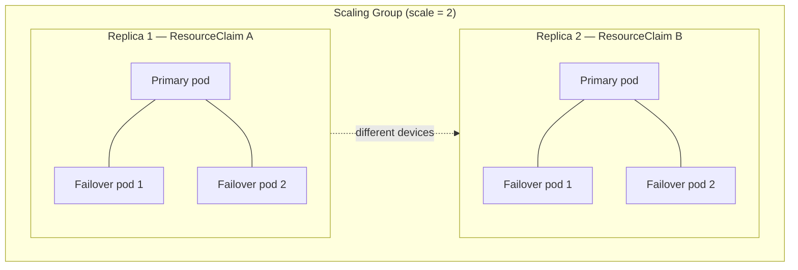
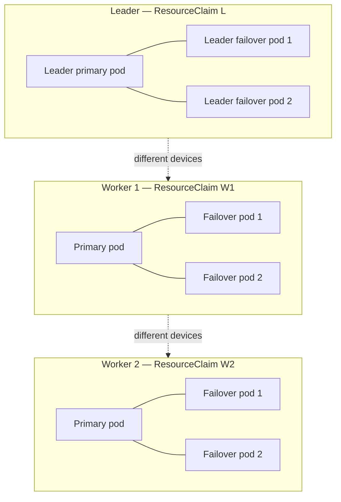

# GREP-390-2: PodClique Failover Pods

<!-- toc -->
- [Summary](#summary)
- [Motivation](#motivation)
  - [Goals](#goals)
  - [Non-Goals](#non-goals)
- [Proposal](#proposal)
  - [User Stories](#user-stories)
    - [Story 1: Singlenode Inference with Crash-Resilient Failover](#story-1-singlenode-inference-with-crash-resilient-failover)
    - [Story 2: Multinode Inference with Per-Node Failover](#story-2-multinode-inference-with-per-node-failover)
  - [Limitations/Risks &amp; Mitigations](#limitationsrisks--mitigations)
- [Design Details](#design-details)
  - [API Changes](#api-changes)
    - [FailoverConfig](#failoverconfig)
    - [PodCliqueSpec Changes](#podcliquespec-changes)
  - [Controller Behavior](#controller-behavior)
  - [Validation](#validation)
  - [Deployment Topologies](#deployment-topologies)
    - [Singlenode](#singlenode)
    - [Multinode](#multinode)
  - [Example PodCliqueSet Manifest](#example-podcliqueset-manifest)
  - [Monitoring](#monitoring)
  - [Dependencies](#dependencies)
  - [Test Plan](#test-plan)
  - [Implementation Phases](#implementation-phases)
    - [Phase 1: API and Controller](#phase-1-api-and-controller)
    - [Phase 2: E2E Tests and Documentation](#phase-2-e2e-tests-and-documentation)
    - [Phase 3: Downstream Consumer Integration](#phase-3-downstream-consumer-integration)
- [Alternatives](#alternatives)
<!-- /toc -->

## Summary

This GREP introduces a `failover` section on `PodCliqueSpec` that allows each clique replica to consist of **1 primary pod + N extra failover (standby) pods**. All pods in a replica group are gang scheduled together and treated as an atomic unit for lifecycle operations. If the primary pod crashes, the workload runtime can promote a failover pod to take over instantly.

This is a generic Grove primitive. Any workload that needs crash-resilient standby pods can use it. A motivating use case is GPU Memory Service (GMS), where standby pods import GPU memory from a shared memory manager so that if the primary crashes, a standby takes over without reloading model weights from disk.

The failover feature composes naturally with shared resource claims proposed in [GREP-390: Hierarchical Resource Sharing](https://github.com/ai-dynamo/grove/pull/456). When both are used together, failover pods share expensive hardware resources (e.g. GPUs) with the primary pod via a shared ResourceClaim — enabling zero-downtime failover without resource reallocation. The examples in this GREP use `resourceClaimTemplateNames` from GREP-390 to illustrate this combined pattern.

## Motivation

Certain workloads require standby pods for fast crash recovery. For example, in GPU-accelerated inference, an out-of-process memory manager can enable zero-copy weight sharing across pods: one pod actively serves requests while standby pods hold references to the same GPU memory. If the active pod crashes, a standby takes over immediately — no model reload, no GPU reallocation.

Grove's current `PodCliqueSpec` has no way to express this. The `replicas` field controls the number of pods, but each replica is exactly 1 pod. There is no concept of "each replica is a group of pods (1 primary + N standbys)."

Concretely, there is no way to express:

> "This clique has 4 replicas. Each replica is actually 3 pods (1 primary + 2 failover)."

### Goals

- Add an optional `failover` section to `PodCliqueSpec` that defines the number of extra (failover) pods per clique replica.
- When `failover` is present, the PodClique controller must schedule `1 + failover.replicas` pods per replica, gang scheduled together as an atomic unit.
- Maintain full backward compatibility: omitting `failover` produces identical behavior to today (1 pod per replica).
- Add validation webhook rules for the new field.

### Non-Goals

- Runtime failover orchestration (deciding which pod becomes the new primary, health-checking standbys, etc.). This is the responsibility of the workload or an external controller.
- Shared resource claims across pods in a PCLQ instance (covered by [GREP-390](https://github.com/ai-dynamo/grove/pull/456)).
- DRA driver implementation or changes to the Kubernetes DRA API.
- Internals of any specific consumer (e.g. GMS memory management, Dynamo graph topology).
- Autoscaling behavior for failover pods (may be addressed in a future GREP).
- Defining different `podSpec` configurations for primary vs failover pods (all pods in a replica share the same `podSpec`).

## Proposal

Add an optional **`failover`** block to `PodCliqueSpec`:

```yaml
spec:
  roleName: worker
  replicas: 4               # 4 clique replicas
  failover:                  # optional — enables primary + failover pod groups
    replicas: 2              # 2 extra (failover) pods per clique replica
  podSpec:
    containers: [...]
```

**Semantics:**

- `replicas` (clique-level): Number of clique replicas (unchanged from today).
- `failover.replicas`: Number of **extra** (failover) pods **per clique replica**. Each replica = 1 primary + `failover.replicas` failover pods.

**Total pods per clique replica** = 1 + `failover.replicas` (or just 1 if `failover` is omitted).
**Total pods for the clique** = `replicas` x (1 + `failover.replicas`).

**Why `failover` as a dedicated section?**

1. **No mental math.** The clique's `replicas` stays the same as today (number of clique replicas) and `failover.replicas` is clearly "extra pods." No confusion about whether a count means total or additional.
2. **Extension point.** A dedicated block provides a natural place for future failover-related configuration (e.g. health-check policy, promotion strategy) without polluting the top-level spec.
3. **Backward compatible.** Omit `failover` and behavior is identical to today: 1 pod per replica.

**Composability with shared resource claims:**

The failover feature composes with `resourceClaimTemplateNames` from [GREP-390](https://github.com/ai-dynamo/grove/pull/456). When both are used, all pods in a replica group (1 primary + N failover) share the ResourceClaims created from the referenced templates. Either feature can be used independently.

### User Stories

#### Story 1: Singlenode Inference with Crash-Resilient Failover

A platform team deploys a singlenode inference workload where each worker holds large model weights in GPU memory. They want crash resilience without the cost of reloading weights from disk.

They configure a PodClique with `replicas: 2` and `failover.replicas: 2`, combined with `resourceClaimTemplateNames: [gpu-claim-template]` (from [GREP-390](https://github.com/ai-dynamo/grove/pull/456)). This creates 2 independent groups, each with 1 primary pod and 2 failover pods sharing the same GPUs via a shared ResourceClaim. If a primary pod crashes, the workload runtime promotes a failover pod that already holds references to the GPU memory — resulting in near-instant recovery.

#### Story 2: Multinode Inference with Per-Node Failover

A platform team runs a multinode disaggregated inference workload with 1 leader and 4 workers across multiple nodes. Each node-group needs its own failover pods sharing GPUs.

They configure:
- A leader PodClique (`replicas: 1`, `failover.replicas: 2`, `resourceClaimTemplateNames: [leader-gpu-template]`) — 1 leader primary + 2 failover pods, sharing one ResourceClaim.
- A worker PodClique (`replicas: 4`, `failover.replicas: 2`, `resourceClaimTemplateNames: [worker-gpu-template]`) — 4 worker groups, each with 1 primary + 2 failover pods, each group sharing its own ResourceClaim.

Both cliques are placed in a `PodCliqueScalingGroup` so they scale together. Each group's pods share GPUs internally; different groups use different GPUs.

### Limitations/Risks & Mitigations

**Risk 1: Failover Pod Scheduling**

All pods in a replica group (1 primary + N failover pods) are gang scheduled together — either all are placed or none are. The `minAvailable` field on a PodClique operates at the **replica** level: `minAvailable: 1` means at least 1 full replica (including all its pods — primary + failover) must be successfully scheduled. If the scheduler cannot place the entire group (e.g. insufficient non-GPU resources on candidate nodes), the replica group will remain pending.

*Mitigation*: Clear status reporting will surface scheduling failures for replica groups. Users should ensure nodes have sufficient capacity for all pods in a group, not just the primary.

**Risk 2: Interaction with Rolling Updates**

When a PodClique template is updated, the rolling update strategy must handle replica groups (1 primary + N failover pods) as a unit, not individual pods.

*Mitigation*: The controller will treat a replica group as the atomic unit for rolling updates. All pods in a replica group are recreated together.

## Design Details

### API Changes

#### FailoverConfig

```go
// FailoverConfig defines the failover pod configuration for a PodClique.
// When set, each clique replica consists of 1 primary pod + Replicas failover pods.
// All pods in the replica are gang scheduled together and treated as an atomic unit.
type FailoverConfig struct {
    // Replicas is the number of extra (failover) pods per clique replica.
    // Each clique replica will have 1 primary + Replicas failover pods.
    // Must be >= 1.
    // +kubebuilder:validation:Minimum=1
    Replicas int32 `json:"replicas"`
}
```

#### PodCliqueSpec Changes

The existing `PodCliqueSpec` will be extended with an optional `Failover` field:

```go
// PodCliqueSpec defines the specification of a PodClique.
type PodCliqueSpec struct {
    // RoleName is the name of the role that this PodClique will assume.
    RoleName string `json:"roleName"`
    // Spec is the spec of the pods in the clique.
    PodSpec corev1.PodSpec `json:"podSpec"`
    // Replicas is the number of replicas of the pods in the clique. It cannot be less than 1.
    Replicas int32 `json:"replicas"`
    // MinAvailable defines the minimum number of replicas guaranteed to be gang scheduled
    // and the minimum requirement of available replicas. Violation of this threshold will
    // result in termination of the PodGang that it belongs to.
    // If not set, defaults to Replicas.
    // +optional
    MinAvailable *int32 `json:"minAvailable,omitempty"`
    // StartsAfter defines startup dependencies amongst cliques.
    // +optional
    StartsAfter []string `json:"startsAfter,omitempty"`
    // ScaleConfig is the horizontal pod autoscaler configuration for a PodClique.
    // +optional
    ScaleConfig *AutoScalingConfig `json:"autoScalingConfig,omitempty"`
    // Failover defines the failover pod configuration. When set, each clique replica
    // consists of 1 primary pod + failover.replicas failover pods. All pods in the
    // replica group are gang scheduled together and treated as an atomic unit.
    // Omit to get the default behavior: 1 pod per replica.
    // +optional
    Failover *FailoverConfig `json:"failover,omitempty"`
}
```

### Controller Behavior

When `failover` is set on a `PodCliqueSpec`, the controller changes its per-replica behavior:

1. **Pod Creation**: For each clique replica, the controller creates `1 + failover.replicas` pods instead of 1. All pods share the same `podSpec`.

2. **Pod Naming**: Pods within a replica are identified by a failover index appended to the pod hostname. Today, pod hostnames follow the pattern `{pclq-name}-{podIndex}`. With failover enabled, the hostname extends to include a failover index: `{pclq-name}-{podIndex}-fo-{foIndex}`, where `foIndex` ranges from `0` to `failover.replicas`. Index 0 is the initial primary; the application controls any subsequent promotion — Grove does not assign or track primary/failover roles via labels, since the active primary can change at the application level without Grove's involvement.

   For example, with a PodClique named `myworkload-0-prefill-worker` at pod index 3 and `failover.replicas: 2`:
   - `myworkload-0-prefill-worker-3-fo-0`
   - `myworkload-0-prefill-worker-3-fo-1`
   - `myworkload-0-prefill-worker-3-fo-2`

3. **Replica Lifecycle**: A replica group (all pods at a given pod index, across failover indices 0..N) is treated as an atomic unit for creation, deletion, and rolling updates.

4. **Gang Scheduling**: All pods in the replica group are gang scheduled together. The scheduler must place all `1 + failover.replicas` pods for a replica to be considered scheduled.

5. **Pod Deletion and Replacement**: If a single pod in the replica group is deleted, the controller creates a replacement pod with the same failover index. The replica group is not torn down unless all pods are deleted or the replica itself is scaled away.

6. **Composability with Shared Claims**: When `resourceClaimTemplateNames` is also set (via [GREP-390](https://github.com/ai-dynamo/grove/pull/456)), the shared ResourceClaims are added to all pods in the replica group (primary + failover). The claims persist for the lifetime of the replica group and are not deleted when individual pods are replaced.

### Validation

The following webhook validation rules apply when `failover` is set:

- `failover.replicas` must be >= 1.

### Deployment Topologies

#### Singlenode

Each worker replica = 1 primary pod + N failover pods. When combined with shared resource claims from [GREP-390](https://github.com/ai-dynamo/grove/pull/456), all pods in a replica share the same ResourceClaim. Scaling out adds more independent groups, each with its own claim (different devices).



#### Multinode

1 leader (1 primary + N failover pods) + M workers (each 1 primary + N failover pods). A `PodCliqueScalingGroup` ties the leader and worker cliques together. When combined with shared resource claims, each group shares a ResourceClaim internally; different groups use different claims.



### Example PodCliqueSet Manifest

This example uses `resourceClaimTemplateNames` from [GREP-390](https://github.com/ai-dynamo/grove/pull/456) to show the combined pattern of failover pods with shared resource claims.

```yaml
apiVersion: core.grove.nvidia.com/v1alpha1
kind: PodCliqueSet
metadata:
  name: inference-workload
  namespace: default
spec:
  replicas: 1
  template:
    spec:
      headlessServiceConfig:
        publishNotReadyAddresses: true

      cliques:
        # Frontend: 2 replicas, no failover, no shared claims (1 pod per replica)
        - name: frontend
          spec:
            roleName: frontend
            replicas: 2
            podSpec:
              containers: []

        # Prefill leader: 1 replica, 1 primary + 2 failover pods sharing one claim
        - name: prefill-leader
          resourceClaimTemplateNames:          # from GREP-390
            - prefill-leader-gpu-template
          spec:
            roleName: prefill-leader
            replicas: 1
            failover:
              replicas: 2
            podSpec:
              containers: []

        # Prefill worker: 4 replicas, each with 1 primary + 2 failover pods sharing one claim
        - name: prefill-worker
          resourceClaimTemplateNames:          # from GREP-390
            - prefill-worker-gpu-template
          spec:
            roleName: prefill-worker
            replicas: 4
            failover:
              replicas: 2
            podSpec:
              containers: []

      podCliqueScalingGroups:
        - name: prefill
          replicas: 1
          cliqueNames:
            - prefill-leader
            - prefill-worker
```

### Monitoring

**Status Fields:**

The following status information will aid in monitoring failover-enabled PodCliques:

- `PodCliqueStatus.Replicas`: Total number of non-terminated pods. With failover, this equals `replicas * (1 + failover.replicas)`.
- `PodCliqueStatus.ReadyReplicas`: Number of ready pods across all replica groups.
- Existing condition `MinAvailableBreached` continues to work: if the number of running pods in any replica group falls below the threshold, the condition is set.

**Events:**

- Event emitted when a failover pod is created or deleted within a replica group.

### Dependencies

- This GREP has no hard dependencies on other GREPs. Failover pods (extra pods per replica) work independently.
- For the common pattern of failover pods sharing hardware resources, this GREP composes with [GREP-390: Hierarchical Resource Sharing](https://github.com/ai-dynamo/grove/pull/456), which introduces `resourceClaimTemplateNames` for per-instance shared DRA ResourceClaims.

### Test Plan

**Unit Tests:**

- Verify that `failover.replicas` creates `1 + N` pods per clique replica.
- Verify that omitting `failover` produces identical behavior to today.
- Verify validation rejects `failover.replicas < 1`.
- Verify rolling update treats each replica group as an atomic unit.
- Verify that deleting a single pod in a replica group triggers replacement, not full group teardown.

**E2E Tests:**

- Create a PodCliqueSet with `failover`, verify that the expected number of pods are created per replica.
- Delete a single pod in a failover-enabled replica and verify a replacement pod is created.
- Scale out a failover-enabled PodClique and verify new replica groups are created.
- Scale in and verify entire replica groups are torn down together.
- Create a PodCliqueSet with a `PodCliqueScalingGroup` containing failover-enabled cliques and verify correct behavior across leader + worker topology.
- (When combined with GREP-390) Create a PodCliqueSet with both `failover` and `resourceClaimTemplateNames`, verify shared claims are correctly associated with all pods in each replica group.

### Implementation Phases

#### Phase 1: API and Controller

**Scope:**
- Add `FailoverConfig` struct and `Failover` field to `PodCliqueSpec`.
- Implement PodClique controller logic for creating `1 + failover.replicas` pods per replica, gang scheduled as an atomic unit.
- Validation webhook rules for `failover.replicas >= 1`.
- Unit tests for all new logic.

#### Phase 2: E2E Tests and Documentation

**Scope:**
- E2E tests for failover pod lifecycle, scaling, and rolling updates.
- Combined E2E tests with GREP-390 shared resource claims (if available).
- Documentation added to Grove user guide.

#### Phase 3: Downstream Consumer Integration

**Scope:**
- At least one downstream consumer (e.g. Dynamo operator) integrates with the `failover` API.
- Integration testing in a staging environment.

## Alternatives

**Alternative 1: `faultTolerance.replicas: 2`**

Use a `faultTolerance` section instead of `failover`.

*Considerations*: The name is more generic but may be vague — it does not immediately communicate "per clique replica" or the standby pod semantics.

**Alternative 2: `additionalPerReplica: 2`**

Use a top-level integer field on `PodCliqueSpec` instead of a nested `failover` block.

*Considerations*: Simpler API surface (one field vs a struct). However, a dedicated `failover` block provides a natural extension point for future failover-related configuration (e.g. health-check policy, promotion strategy) without polluting the top-level spec.

**Alternative 3: `podsPerInstance: 3`**

Use a total-count field (`podsPerInstance: 3` meaning 1 primary + 2 extra) instead of an additive count.

*Considerations*: Total-count is explicit, but users must do arithmetic to determine primary vs extra pod counts. An additive `failover.replicas: 2` is unambiguous: "2 extra pods."

**Alternative 4: Bundle `resourceClaimTemplateRef` inside `failover`**

Instead of relying on [GREP-390](https://github.com/ai-dynamo/grove/pull/456) for shared resource claims, bundle a `resourceClaimTemplateRef` directly inside the `failover` block.

*Considerations*: Simpler for the specific "failover pods sharing GPUs" use case. However, it conflates two independent concerns (extra pods and resource sharing) into one block. Keeping them separate enables each feature to be used independently and avoids duplicating API surface with GREP-390.
